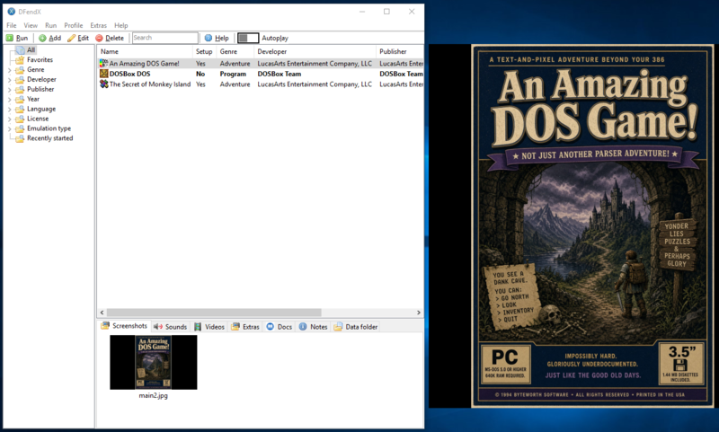

# DFendX

A D-Fend Reloaded fork and modernization effort.

## New Features

### DOSBox-X and DOSBox Staging support

DFendX has first level support for both of these modern DOSBox forks. This includes:

* Inbuilt MT32 and FluidSynth MIDI emulation configuration.
* VSync options.
* Inactive screen behaviour options.
* Ouput render, pixel shaders and preset selection.
* More available machine types to choose from.

### Modern Windows and Unicode support

DFendX is built using Delphi 12 RAD Studio, bringing native support for modern Windows and Unicode text support.

### Direct MIDI interface support

DFendX no longer relies on DOSBox to enumerate MIDI ids, meaning it is faster to launch MIDI configured games.

### eXoDOS

DFendX has direct support for eXoDOS as a source of metadata, media as well as the ability to add games from eXoDOS. 

### Ambient music autoplay

DFendX has the ability to play ambient music for the selected game profile if it has a soundtrack audio file associated with it.

### Title image pane

There is now an option to dislay a selected title image for the current profile in a separate floating pane next to the main window. This can be used to display a game cover, screenshot or any other image.

### Bug fixes and improvements

The modernization effort uncovered many bugs and issues which have been resolved.

## License

This project is licensed under the [GNU GPL v3](LICENSE).

## Compatibility

 Windows 7 and above.

## Acknowledgements

Thanks to the authors of D-Fend Reloaded and D-Fend for making this possible.